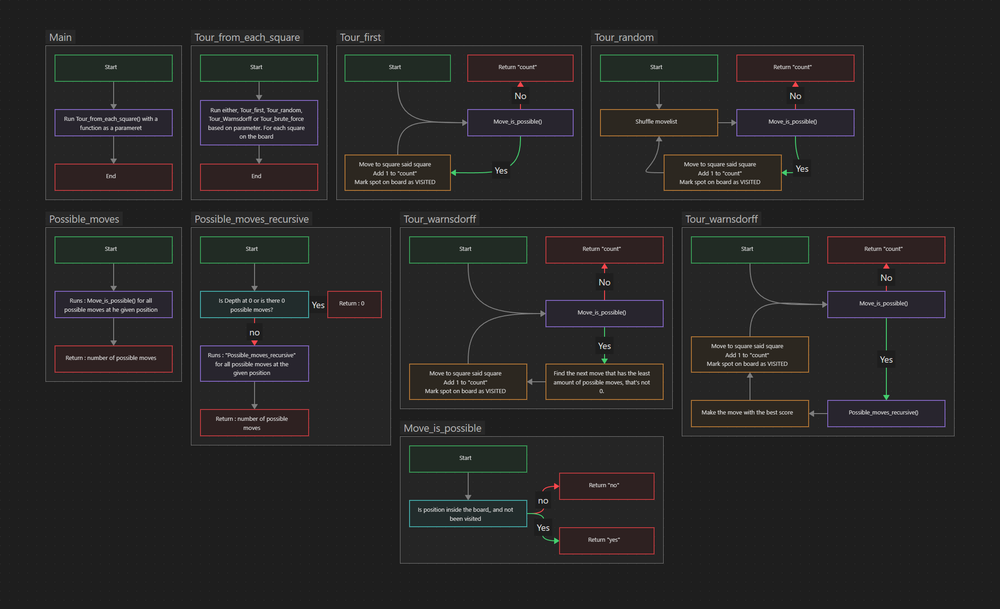

# Knight’s tour

https://c-programming.aydos.de/week06/knights-tour.html

Draw a flowchart 
> Flowchart : 

Make code to solve the [Requirementse](#Requirements)
> Code : [code](.src/main.c)

Changes made to the problem
> [Changes](#Changes)

---

# Problem
>Implement a program that begins on a square and makes the first move that is possible and continues moving in the same manner until it is not possible anymore. This is a greedy algorithm.
>Greedy algorithm - An algorithm that makes the locally optimal choice at each stage.

But since all values have the same value of they are possible to move to. A "greedy" algorithm is not possible to make. 
So i have instead made 4 other algorithms, and not made a "greedy" algorithm, since that is not possible.


# Requirements
1. Your documentation includes flowchart/s.
2. Your program outputs the maximum number of squares toured for each square as follows:

   ```text
   Greedy:
   36 37 43 49 36 35 48 42 
   54 43 35 36 42 48 35 34 
   36 29 54 42 34 35 41 47 
   42 28 35 28 54 41 33 34 
   45 35 41 27 26 27 46 40 
   40  8 44 44 40 26 33 32 
   10 54 46 54 55 31 39 54 
   42 37 35 55 36 32 35 32
   ```
3. Your program uses the following compile-time constants and functions.

   ```c
   #define SIZE 8       /**< Board size. */

   /**
    * Knight move offsets
    *
    * Moves that a knight can make relative to the current position.
    * For example,
    * x += MOVES_X[0]; y += MOVES_Y[0]
    * corresponds to one of the eight moves that a knight can make, where `x` and
    * `y` represent the current position.
    */
   #define MOVE_COUNT 8 /**< Number of moves that a knight can make */
   const int MOVES_X[MOVE_COUNT] = {2, 1, -1, -2, -2, -1, 1, 2};
   const int MOVES_Y[MOVE_COUNT] = {1, 2, 2, 1, -1, -2, -2, -1};

   /** Determines whether a move is possible from a starting position.
    *
    * @param move_id One of the 8 moves that the knight wants to make [0, 7]
    * @param x Current horizontal position
    * @param y Current vertical position
    * @param visited A two-dimensional array that represents the squares. If a
    * value is positive, then the corresponding field was visited before.
    * @return True if the move is possible, else false.
    */
   bool move_is_possible(size_t move_id, size_t x, size_t y, board_t visited);
   
   /** Attempts a tour by picking the first accessible square.
    *
    * @param start_x Horizontal starting position on the board
    * @param start_y Vertical starting position on the board
    * @return The number of visited squares
    * @note An array is created for the attempt
    */
   unsigned int tour_greedy(size_t start_x, size_t start_y);
   
   /** Attempts tours beginning from each square available on the board
    * and annotates the number of visited squares like this:
    *
    * 15  8 15 15 
    * 10  6  4 15 
    *  8 10 14 14 
    * 14 14 14 11 
    */
   void greedy_tour_from_each_square();
   ```
4. Even `SIZE` is 8 as default, your program should also work with `SIZE`s other than 8.
5. Organize your project into the files `knights_tour.{h,c}` and `main.c`.
6. Optional: Implement a non-greedy approach that prioritizes squares that are more difficult to access compared to others. For example the following table shows for each destination square, from how many departure squares the destination square is accessible on a 8x8 board.

   ```plaintext
   2  3  4  4  4  4  3  2 
   3  4  6  6  6  6  4  3 
   4  6  8  8  8  8  6  4 
   4  6  8  8  8  8  6  4 
   4  6  8  8  8  8  6  4 
   4  6  8  8  8  8  6  4 
   3  4  6  6  6  6  4  3 
   2  3  4  4  4  4  3  2
   ```
   
# Changes
1. Did not make a greedy algorithm, instead i added
   1. A algorithm picks the first possible move it find
   2. A algorithm that picks a random possible move
   3. The Warnsdorff algorithm
   4. A recursive function that checks X moves forward, and picks the one with most options